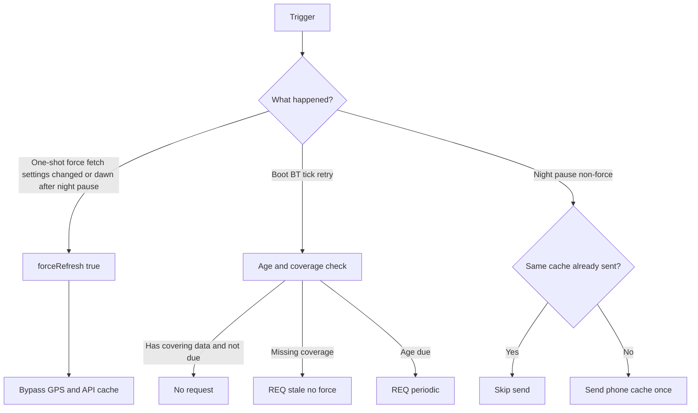

# Argus — design notes

Living reference for non-obvious mechanisms. When changing these, update this file.

## Weather update flow

Weather refreshes are age- and coverage-aware. Force (bypass phone GPS/API caches) is reserved for:

- One-shot **Weather force update** (clears itself after save)
- Real changes to fetch inputs: `LocationMode`, `ManualLocation`, `ForecastHours`, `WeatherProvider`
- **Night pause end**: first minute after sunrise while Pause at night is enabled (`weather_on_minute` → `weather_request_force`), regardless of the configured update interval

Boot, BT reconnect, retries, and periodic ticks use coverage/age checks instead of force. At night, the phone does not re-send the same cache payload to the watch if it was already delivered successfully.

### Night pause and chart night bands

Night is defined from Open-Meteo daily **sunrise/sunset** epochs (sent as `WeatherSunriseEpochs` / `WeatherSunsetEpochs`, persisted on the watch).

- Pause: `weather_is_night_at` / phone `weatherIsNightNow` — night when `now` is outside every `[sunrise[i], sunset[i])`
- Chart chamfer: hatch edges at those exact times (X interpolated between hour samples)
- Fallback when sun times are missing: hourly `is_day`, then local 20:00–06:00

### Request kinds (watch → phone)

| Kind | Name | Phone behaviour |
|------|------|-----------------|
| `0` | periodic | Respect GPS + phone weather cache |
| `1` | force | Bypass caches; hit network |
| `2` | stale | Coverage gap; may reuse phone caches |

### Key code

| Area | Location |
|------|----------|
| Watch age/coverage helper | `weather_request_if_needed()` in `src/c/weather.c` |
| Night→day force | `weather_on_minute()` in `src/c/weather.c` (from `prv_tick_handler`) |
| Phone force / night / sent marker | `src/pkjs/index.js` |
| One-shot force toggle | Clay `WeatherForceUpdate` (PKJS-only) |
