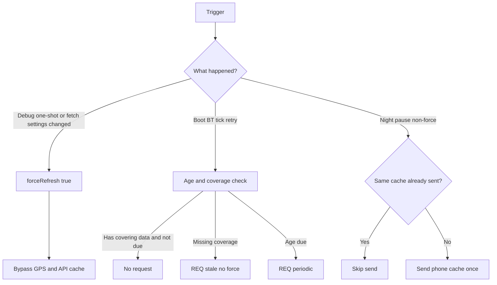

# Argus — design notes

Living reference for non-obvious mechanisms. When changing these, update this file.

## Weather update flow

Weather refreshes are age- and coverage-aware. Force (bypass phone GPS/API caches) is reserved for:

- Debug one-shot **Weather force update** (clears itself after save)
- Real changes to fetch inputs: `LocationMode`, `ManualLocation`, `ForecastHours`, `WeatherProvider`

Boot, BT reconnect, retries, and periodic ticks use coverage/age checks instead of force. At night, the phone does not re-send the same cache payload to the watch if it was already delivered successfully.

### Request kinds (watch → phone)

| Kind | Name | Phone behaviour |
|------|------|-----------------|
| `0` | periodic | Respect GPS + phone weather cache |
| `1` | force | Bypass caches; hit network |
| `2` | stale | Coverage gap; may reuse phone caches |

### Key code

| Area | Location |
|------|----------|
| Watch age/coverage helper | `weather_request_if_needed()` in `src/c/weather.c` |
| Phone force / night / sent marker | `src/pkjs/index.js` |
| Debug one-shot toggle | Clay `WeatherForceUpdate` (PKJS-only) |
