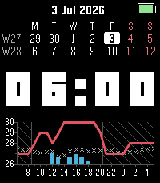
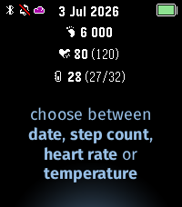
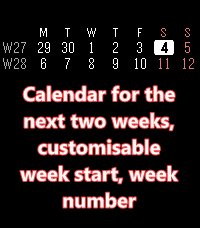
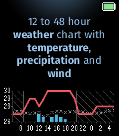

# Argus

Argus guides you through the days ahead with hourly weather forecast, a two-week calendar view and a configurable header to focus on what is important.  
Inspired by [WarnWeather](https://github.com/Toasbi/WarnWeather).

  
## Features

- **Header**: week number (ISO or Gregorian), month/year, Bluetooth status, battery level
- **Calendar**: current and next week with Monday or Sunday week start; today highlighted
- **Time**: 12h/24h (system override or forced format)
- **Weather**: Open-Meteo hourly temperature line and precipitation bars (12/24/48h); configurable forecast model, refresh interval, night pause, and GPS reuse
- **Settings**: Clay configuration page on the phone

### Weather settings

Display and location (in order):

| Setting | Default | Notes |
|---------|---------|-------|
| Temperature scale | °C | °C or °F on watch and chart |
| Forecast | 24h | Chart window: 12, 24, or 48 hours |
| Feels-like temperature | Off | Actual vs apparent temperature on chart |
| Location | Auto | Auto uses phone GPS; Manual uses city geocoding |
| City name | — | Shown only when Location is Manual |
| GPS update frequency | 30 min | How long a GPS fix is reused (Auto only) |

Fetch behaviour:

| Setting | Default | Notes |
|---------|---------|-------|
| Weather model | Auto | Open-Meteo seamless models (ECMWF, GFS, ICON, Météo-France, JMA, GEM, UKMO) |
| Pause at night | Off | Skips periodic refreshes during chart night hours |
| Update interval | 30 min | Watch request cadence: 5, 15, 30, or 60 minutes |

Weather data is fetched on the phone via Open-Meteo (no API key). Each update sends a full hourly payload to the watch; refresh interval and GPS reuse settings reduce how often the phone hits the network or re-acquires location.

## Development

Build instructions, emulator setup, and troubleshooting are in [DEVELOPMENT.md](DEVELOPMENT.md).
